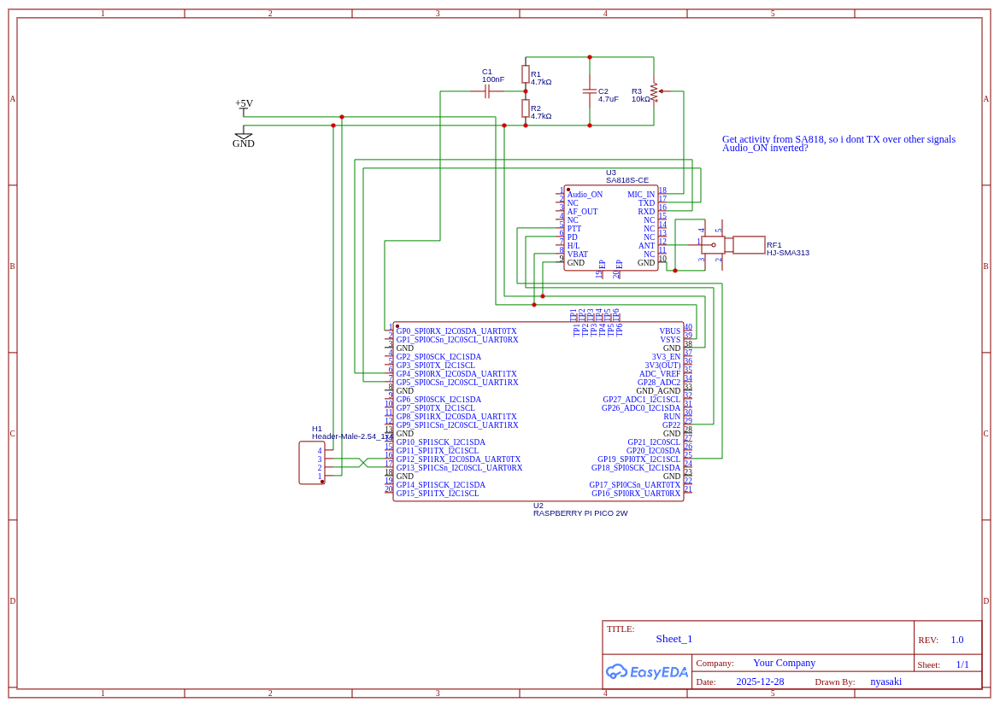

# APRS Beacon #
This project demonstrates how to use [raspi-pico-aprs-tnc](https://github.com/eleccoder/raspi-pico-aprs-tnc/tree/main) to build a standalone APRS beacon with minimal additional hardware. 
### Hardware used 
- **Raspberry Pi Pico 2 (RP2350)** 
- **NiceRF SA818 VHF/UHF RF module** 
- **u-blox NEO-6M GPS breakout board** 

The Pico 2 generates the AFSK audio using raspi-pico-aprs-tnc and feeds it directly into the microphone input of the SA818 module. Position data is provided by the NEO-6M GPS module over UART and encoded into APRS packets that are transmitted automatically at a fixed interval. 
**(TODO: Smart Beaconing)**

My rather amateur schematic 
 

### Custom PCB 
A custom PCB was designed to integrate all required hardware into a compact standalone beacon. 

The PCB design files are not published yet because the first revision was not fully functional.  
All known errors are already fixed in the schematic shown above.

#### On-board components
- **Raspberry Pi Pico 2 (RP2350)**
  – main controller running the APRS encoder and AFSK generator
- **NiceRF SA818 RF module** 
  – VHF/UHF transceiver used to transmit the APRS AFSK signal 
- **SMA antenna connector** 
  – external antenna interface
- **4-pin GPS header** 
  – To directly solder on a u-blox NEO-6M GPS breakout board (VCC, GND, TX, RX) 

The PCB provides a minimal, self-contained APRS beacon requiring only power and an antenna.

---

# raspi-pico-aprs-tnc


A TX-only [TNC](https://en.wikipedia.org/wiki/Terminal_node_controller) (Terminal Node Controller) to generate the [AFSK](https://en.wikipedia.org/wiki/Frequency-shift_keying#Audio_FSK) (Audio Frequency-Shift Keying) audio tones for [APRS](https://en.wikipedia.org/wiki/Automatic_Packet_Reporting_System) (Automatic Packet Reporting System) messages using a [RP2040](https://en.wikipedia.org/wiki/RP2040) microcontroller on a [Raspberry Pi Pico](https://en.wikipedia.org/wiki/Raspberry_Pi#Pico_series) board. Works also for the newer [RP2350](https://en.wikipedia.org/wiki/RP2350) microcontroller on a Pico2 board.


Block diagram showing the signal flow

An analog line-out audio signal will be generated by a band-pass filter connected to GPIO-pin 'GP0' which provides the binary PWM signal. You can probe it by a scope, listen to it by using an audio amp, or connect it to any RF transceiver to send it on the air (ham radio license required).


Image: Line-out signal (see [below](#Hardware)) probed by a DSO. We clearly see the 1200 Hz and 2200 Hz tones of the 1200 Bd 2-AFSK.

Both a static library `libaprs_pico.a` and the beacon application will be generated by the build.


### Prerequisites

Your host platform for cross-compilation is assumed to be LINUX.

1. Install the Pico-SDK following the instructions given in the [Raspberry Pi 'Getting Started' Guide](https://datasheets.raspberrypi.org/pico/getting-started-with-pico.pdf) (pdf)
1. Set the `PICO_SDK_PATH` environment variable to point to your Pico-SDK installation directory
1. Install the [pico-extras](https://github.com/raspberrypi/pico-extras) libraries:

```
  cd $PICO_SDK_PATH/..
  git clone -b master https://github.com/raspberrypi/pico-extras.git
  cd pico-extras
  git submodule update --init
```

### Hardware

We just need a simple band-pass filter to extract the analog AFSK-signal from the binary PWM signal:


The line-out voltage can be as high as 2.7 V<sub>pp</sub> (~1 V<sub>rms</sub>) (at full-scale volume setting in the software and high-impedance load).

### Build the library and the 'beacon' application

```
git clone https://github.com/eleccoder/raspi-pico-aprs-tnc.git
cd raspi-pico-aprs-tnc
cmake -S . -B build   # For Pico2: cmake -S . -B build DPICO_BOARD=pico2
cmake --build build
```

`build/lib/libaprs_pico.a` and `build/aprs_pico_beacon[.uf2|.elf|.bin|.hex]` will be generated.

### Run the 'beacon' application

The analog AFSK audio signal will be available at the filter's line-out. You can probe it by a scope, listen to it by using an audio amp, or connect it to any RF transceiver to send it on the air (ham radio license required).

But for testing the signal integrity, you can feed the signal into the soundcard of your computer and let decode its data content by [Dire Wolf](https://github.com/wb2osz/direwolf) - see down below.

#### Flash the Pico(2)

Flash the file `build/aprs_pico_beacon_demo[.uf2|.elf|.bin|.hex]` to the Pico(2) board in the same way as you're usually doing.


#### Test the 'beacon' application using *Dire Wolf* (on LINUX)

We can use the famous [Dire Wolf](https://github.com/wb2osz/direwolf) CLI software to decode the APRS data after sampling our APRS audio signal by means of a soundcard.

1. Connect the line-out of our circuit above to the microphone input of your soundcard of your (ALSA-supported) LINUX system.
2. Check if you can hear the typical APRS 'modem-sound' on your audio output device by monitoring the input signal (44.1 kHz, mono, WAVE):

```
arecord -f cd -c 1 - | aplay
```

3. Install [Dire Wolf](https://github.com/wb2osz/direwolf) on your system. Probably, you just have to run:

```
sudo apt install direwolf
```

4. Let's sample the APRS audio signal fed to the soundcard and forward the audio stream to *Dire Wolf* (44.1 kHz, mono, WAVE):

```
arecord -f cd -c 1 - | direwolf -
```

5. Enjoy the decoded APRS message:


# Ingredients / Acknowledgements
- A **HUGE** thanks to the [original author](https://github.com/eleccoder) of the [library](https://github.com/eleccoder/raspi-pico-aprs-tnc/tree/main) and the basic beacon demo

- For `APRS Payload => AX.25 => AFSK (PCM)` conversion I'm using [my modified version](https://github.com/eleccoder/ax25-aprs-lib) of [fsphil's ax25beacon](https://github.com/fsphil/ax25beacon) project.
- For `PCM => PWM` conversion I'm using the `pico_audio_pwm` library from [pico-extras](https://github.com/raspberrypi/pico-extras) (NOTE: ATTOW, maturity seems to be rather alpha/beta).
- Basic PWM audio rendering with the Pi Pico has been spotted in the [pico-playground](https://github.com/raspberrypi/pico-playground/tree/master/audio).
